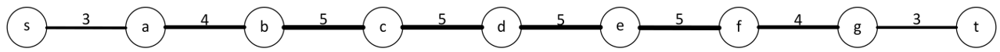
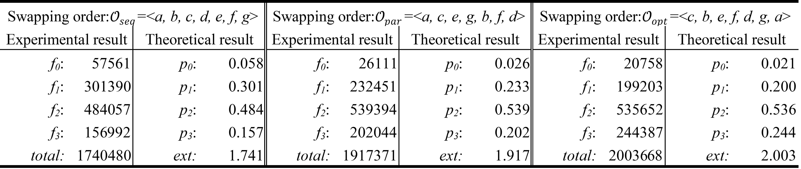
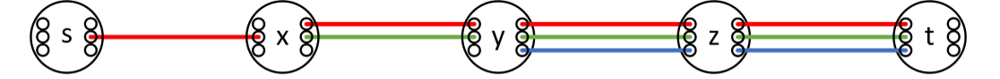
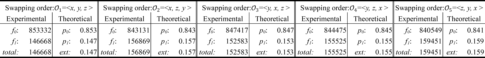

# Order Matters: On the Impact of Swapping Order on an Entanglement Path in a Quantum Network
Python implementation of "Order Matters: On the Impact of Swapping Order on an Entanglement Path in a Quantum Network" (IEEE INFOCOM 2022).
## Environment
* python == 3.9.13
* numpy == 1.23.4

## Example usage 
```python
# Setup graph
print('\n')
print('   1     2     3     3   ')
print('s-----x-----y-----z-----t')
s = Vertex(w={'x':1}, W=3, name='s', p=0.5, q=0.8)
x = Vertex(w={'s':1, 'y':2}, W=3, name='x', p=0.5, q=0.8)
y = Vertex(w={'x':2, 'z':3}, W=3, name='y', p=0.5,q=0.8)
z = Vertex(w={'y':3, 't':3}, W=3, name='z', p=0.5, q=0.8)
t = Vertex(w={'z':3}, W=3, name='t', p=0.5, q=0.8)

graph =Graph()
graph.add_vertex(s)
graph.add_vertex(x)
graph.add_vertex(y)
graph.add_vertex(z)
graph.add_vertex(t)

## Simulate impact of swapping order 
order = ['x', 'y', 'z']
simulate_swapping_effect(graph, order)
```
## Result







## Citation
A. Chang and G. Xue, "Order Matters: On the Impact of Swapping Order on an Entanglement Path in a Quantum Network," IEEE INFOCOM 2022 - IEEE Conference on Computer Communications Workshops (INFOCOM WKSHPS), 2022, pp. 1-6, doi: 10.1109/INFOCOMWKSHPS54753.2022.9798254.
```
@INPROCEEDINGS{9798254,
  author={Chang, Alena and Xue, Guoliang},  
  booktitle={IEEE INFOCOM 2022 - IEEE Conference on Computer Communications Workshops (INFOCOM WKSHPS)},   
  title={Order Matters: On the Impact of Swapping Order on an Entanglement Path in a Quantum Network},   
  year={2022},  
  volume={},  
  number={},  
  pages={1-6},  
  doi={10.1109/INFOCOMWKSHPS54753.2022.9798254}}
```